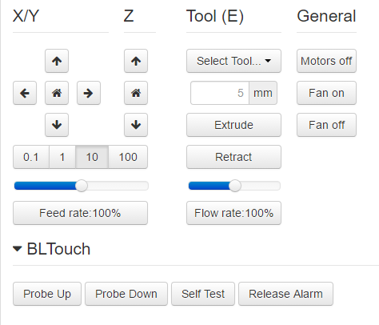

# OctoPrint-LIS3DH

A simple plugin to add buttons on the control tab to manage LIS3DH.

## Setup

Install via the bundled [Plugin Manager](https://github.com/foosel/OctoPrint/wiki/Plugin:-Plugin-Manager)
or manually using this URL:

    https://github.com/Pargon1970/OctoPrint-LIS3DH/archive/master.zip
	
## Support My Efforts
I programmed this plugin for fun and do my best effort to support those that have issues with it, please return the favor and support me.

